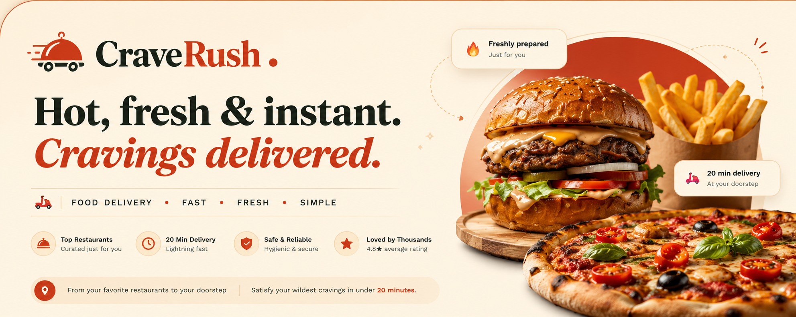
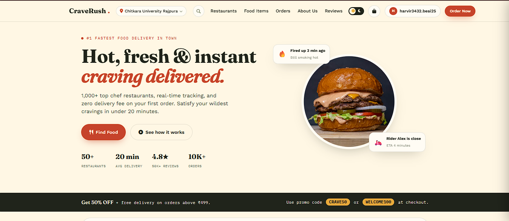
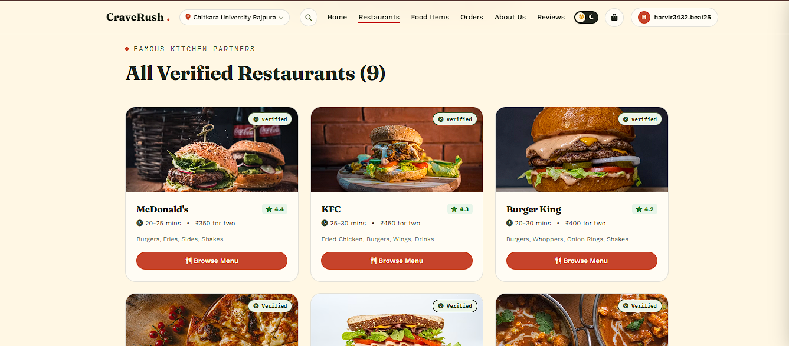
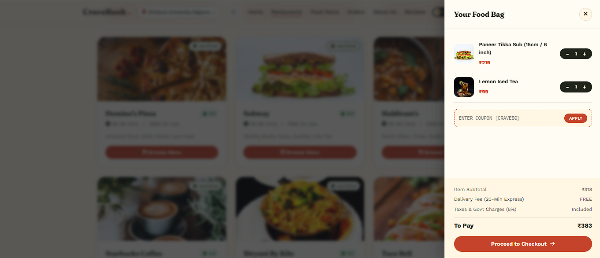
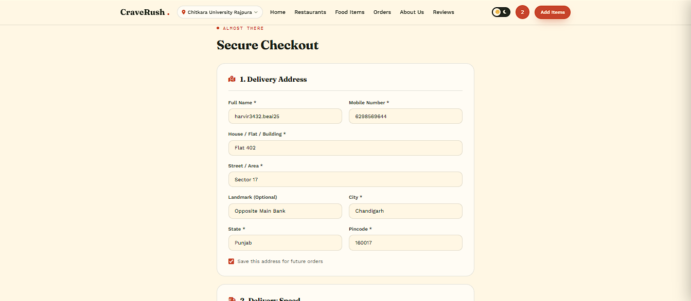
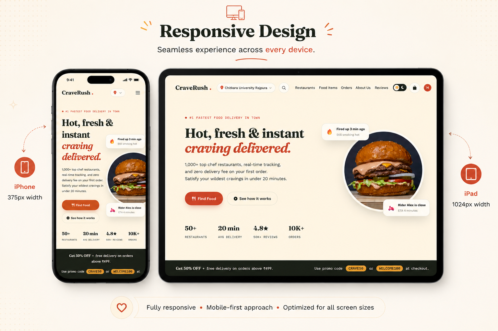
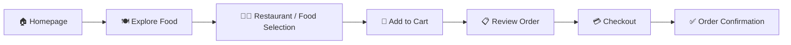

# 🍔 CraveRush

### *Your cravings. One click away. ⚡*

<div align="center">



<br><br>

**A modern, responsive food delivery website designed to make discovering, exploring, and ordering your favourite food a delicious experience.**

<br>

[🌐 Live Demo](https://crave-rush.vercel.app) • [📸 Screenshots](#screenshots) • [✨ Features](#features) • [🚀 Getting Started](#getting-started)

<br>


</div>

---

## 🍕 What is CraveRush?

**CraveRush** is a modern food delivery web experience built with a focus on **clean UI, responsiveness, intuitive navigation, and an engaging food-discovery experience**.

From browsing delicious food categories to exploring restaurants and moving through the ordering flow, CraveRush is designed to make the entire journey feel **fast, simple, and enjoyable.**

> 🍔 **Discover. Choose. Crave. Rush.**

---

# ✨ Features

<table>
<tr>
<td width="50%">

### 🏠 Modern Homepage

An attractive landing page designed to immediately grab the user's attention and make food discovery effortless.

</td>

<td width="50%">

### 🍽️ Food Discovery

Browse different food options through a clean and visually engaging interface.

</td>
</tr>

<tr>
<td>

### 🔍 Easy Navigation

Simple navigation makes it easy for users to move between different sections of the website.

</td>

<td>

### 🛒 Ordering Experience

A structured ordering flow that guides users from food discovery toward checkout.

</td>
</tr>

<tr>
<td>

### 📱 Responsive Design

Designed to provide a smooth experience across desktop, tablet, and mobile screen sizes.

</td>

<td>

### 🎨 Modern UI

Bold food imagery, cards, buttons, spacing, typography, and visual hierarchy create an engaging interface.

</td>
</tr>
</table>

---

# 📸 Screenshots

## 🏠 Homepage

<div align="center">



</div>

---

## 🍔 Food & Restaurant Section

<div align="center">



</div>

---

## 🛒 Cart / Ordering Flow

<div align="center">



</div>

---

## 💳 Checkout

<div align="center">



</div>

---

# 📱 Responsive Design

CraveRush follows a **responsive, mobile-first approach**, ensuring that the interface adapts smoothly to different screen sizes.

<div align="center">



</div>

### 💻 Desktop

Full-width layouts with expanded navigation and spacious food cards.

### 📱 Tablet

Flexible grids and adjusted spacing for medium-sized screens.

### 📲 Mobile

Compact navigation, stacked content, touch-friendly controls, and optimized layouts.

---

# 🎨 Design Philosophy

CraveRush was designed around three core principles:

| Principle             | Goal                                           |
| --------------------- | ---------------------------------------------- |
| 🍔 **Visual Appeal**  | Make food the hero of the experience           |
| ⚡ **Simplicity**      | Keep navigation and interactions intuitive     |
| 📱 **Responsiveness** | Deliver a consistent experience across devices |

The interface uses **strong visual hierarchy, food-focused imagery, card-based layouts, responsive grids, and clear calls-to-action** to create a modern food-delivery experience.

---

# 🧩 Website Flow



---

# 🛠️ Tech Stack

<div align="center">

| Technology       | Purpose                             |
| ---------------- | ----------------------------------- |
| 🌐 **HTML5**     | Website structure                   |
| 🎨 **CSS3**      | Styling and responsive layouts      |
| ⚡ **JavaScript** | Interactivity and dynamic behaviour |

</div>

### Frontend

* Semantic HTML
* CSS Flexbox & Grid
* Responsive design
* CSS animations & transitions
* JavaScript DOM manipulation
* Interactive UI components

---

# 📂 Project Structure

```text
CraveRush/
│
├── 📁 assets/
│   ├── 🖼️ images/
│   ├── 🎨 icons/
│   └── 🏷️ logo/
│
├── 📁 css/
│   └── style.css
│
├── 📁 js/
│   └── script.js
│
├── 📄 index.html
├── 📄 menu.html
├── 📄 cart.html
├── 📄 checkout.html
└── 📄 README.md
```

> Your actual folder structure may differ depending on the current version of the project.

---

# 🚀 Getting Started

### 1️⃣ Clone the repository

```bash
git clone https://github.com/YOUR-USERNAME/CraveRush.git
```

### 2️⃣ Navigate to the project

```bash
cd CraveRush
```

### 3️⃣ Open the website

Open `index.html` in your browser.

Or, for the best development experience, open the project using **VS Code + Live Server**.

---

# ⚡ Quick Preview

```text
                🍔 CRAVERUSH
                     │
                     ▼
              🏠 Discover Food
                     │
                     ▼
             🍕 Explore Options
                     │
                     ▼
               🛒 Add to Cart
                     │
                     ▼
                📋 Review Order
                     │
                     ▼
                 💳 Checkout
                     │
                     ▼
                 🎉 Crave Satisfied!
```

---

# 🔮 Future Scope

CraveRush currently focuses on the **frontend experience**. The project can be extended into a complete food-delivery platform by adding backend functionality.

### 🚀 Planned Improvements

* 🔐 User authentication & registration
* 🗄️ Backend database integration
* 🍽️ Restaurant management
* 🛒 Persistent shopping cart
* 💳 Online payment integration
* 📍 Real-time order tracking
* 🚴 Delivery partner dashboard
* 🔔 Order notifications
* ⭐ Ratings & reviews
* 🔎 Advanced search and filtering
* 🤖 AI-powered food recommendations
* 📊 Restaurant/admin dashboard

---

# 📈 Project Vision

The long-term goal of CraveRush is to evolve from a frontend prototype into a **complete food delivery ecosystem** connecting:

```text
             👤 CUSTOMER
                  │
                  ▼
             🍔 CRAVERUSH
             /     |      \
            /      |       \
           ▼       ▼        ▼
      🍽️ RESTAURANT  🚴 DELIVERY  💳 PAYMENT
           │          │          │
           └──────────┼──────────┘
                      ▼
                🎉 HAPPY CUSTOMER
```

---

# 💡 What I Learned

Building CraveRush helped strengthen practical skills in:

* Responsive web development
* HTML semantic structure
* CSS layouts using Flexbox & Grid
* JavaScript-based interactions
* UI/UX design
* Form validation
* Responsive navigation
* Website organization
* Git & GitHub
* Building a complete frontend project from scratch

---

# 🌟 Why CraveRush?

> **Because food shouldn't just arrive fast — finding it should feel effortless too.**

CraveRush combines **visual design + usability + responsiveness** to create a food-delivery experience that feels modern, simple, and enjoyable.

---

# 👩‍💻 Project

<div align="center">

### 🍔 CraveRush — Food Delivery Website

**Frontend Web Development Project**

<br>

⭐ If you like the project, consider giving the repository a **star**!

<br>

**Made with ❤️ and lots of cravings 🍕🍔🍟**

</div>

---

## 📌 Repository Preview

<div align="center">


### **CRAVERUSH**

*From craving to checkout.*

</div>
